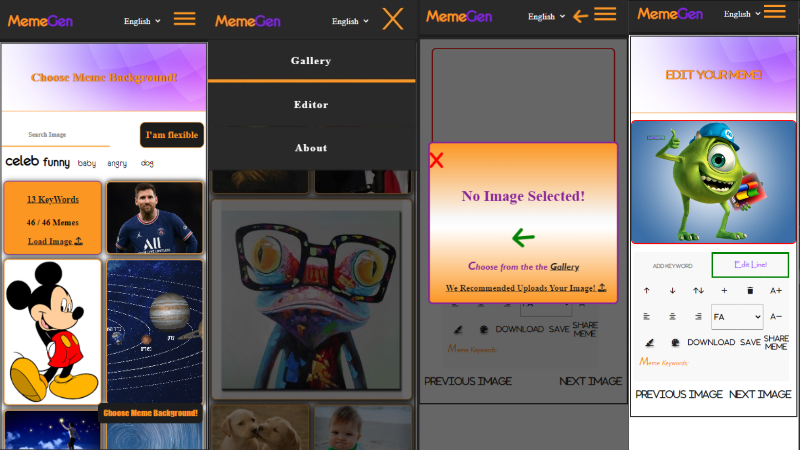
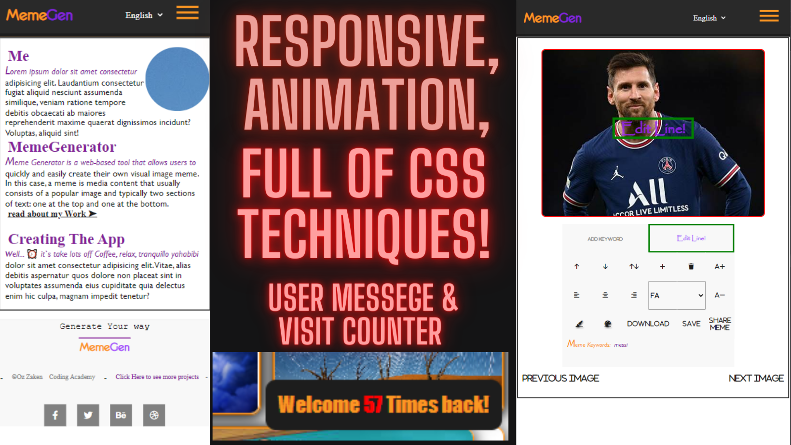

# Meme Generator
A simple, user-friendly and highly interactive Meme-generator app built with vanilla JavaScript.
 ## Introduction
 This is a web application that enables the user to generate memes. The application has two main sections: Gallery and Edit. In the Gallery section, the user can view a collection of memes and select one to edit. In the Edit section, the user can customize the selected meme.
[Check it Out](https://ozzaken.github.io/meme-generator/)

## Main Controller
The main controller (MAIN_CONTROLLER) sets up the window object with the necessary functions and sets up the state of the application.

## Features
- View and select memes from a gallery
- Generate custom memes by selecting images from a gallery or uploading your own
- Add custom text with different font styles and colors to memes
- Translate the app to different languages
- View and save your generated memes